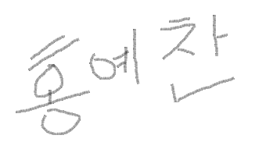

# 1. 첫 블로그 

계절이 지나가는 하늘에는 가을로 가득 차 있습니다.

나는 아무 걱정도 없이 가을 속의 별들을 다 헬 듯 합니다.

# 2. 이미지 삽입

# 3. 글씨 크기  
 
1~6까지 지원  

 

# #d
## ##d
### ###d
#### ####d
##### #####d
###### ######d
   
# 4. BlockQuote
====

> This is a first blockqute.
>	> This is a second blockqute.
>	>	> This is a third  blockqute.
   
> code   

# 5. 줄바꿈
* 줄 바꿈을 하기 위해서는 문장 마지막에서 3칸이상을 띄어쓰기해야 한다.   
이렇게
